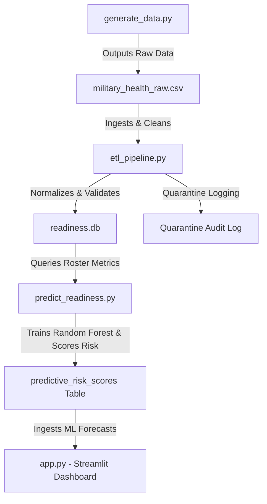

# Military Health Information Governance & Readiness System

An end-to-end data pipeline and application engineered for executive command oversight, featuring automated ETL pipelines and HIPAA/DoD-compliant PHI security layers.

## 🚀 Key Architectural Features

* **Automated ETL Pipeline (`etl_pipeline.py`)**: Extracts, transforms, and loads synthetic health records, ensuring data cleanliness, schema validation, and normalization.
* **Synthetic Data Generation (`generate_data.py`)**: Programmatically generates realistic, compliant mock military readiness and medical status records for testing and analysis.
* **Interactive Command Dashboard (`app.py`)**: Built with Streamlit to provide real-time visualization of medical readiness metrics, deployment statuses, and unit availability.
* **Secure Data Storage (`readiness.db`)**: Uses a structured SQLite relational backend designed to maintain data integrity and support analytical queries.

## 🔄 End-to-End Workflow Architectur

## 🖥️ Executive Command Dashboard UI Preview
```
+-----------------------------------------------------------------------------------+
| 🛡️ Military Health Information Governance & Readiness System                      |
| Executive command oversight dashboard for tracking unit readiness & pipelines.    |
+-----------------------------------------------------------------------------------+
| [Sidebar: Command Filters]                                                        |
|  - Select Unit Code: [ All Units v ]                                              |
|  - Deployment Eligibility: [ All v ]                                              |
+-----------------------------------------------------------------------------------+
|  KPI CARDS & ML FORECAST:                                                         |
|  ┌──────────────────────┬──────────────────┬─────────────────┬─────────────────┐  |
|  │ Total Personnel      │ Fully Deployable │ Readiness Rate  │ 🔮 High Risk (ML)│ |
|  │       1,250          │      1,020       │     81.6%       │    14 Flagged   │  |
|  └──────────────────────┴──────────────────┴─────────────────┴─────────────────┘  |
+-----------------------------------------------------------------------------------+
|  VISUALIZATIONS:                                                                  |
|  ┌───────────────────────────────────┬──────────────────────────────────────────┐ |
|  │ 📊 Deployment Status Breakdown    │ 🦷 Dental Classification Impact         │ |
|  │ [ Donut Chart: Deployable / No ]  │ [ Bar Chart: Class 1, 2, 3, 4 ]          │ |
|  └───────────────────────────────────┴──────────────────────────────────────────┘ |
+-----------------------------------------------------------------------------------+
|  📋 Unit Member Readiness Records (Interactive Data Table + Risk Probability)     |
|  [ID] | [Unit Code] | [Dental Class] | [PHA Status] | [Deployable] | [Risk Score] |
|  -------------------------------------------------------------------------------  |
|  101  | NAVWAR-DET  | Class 1        | Current      | Yes          | 0.12 (Low)   |
|  102  | NAVWAR-DET  | Class 3        | Overdue      | No           | 0.78 (High)  |
+-----------------------------------------------------------------------------------+
