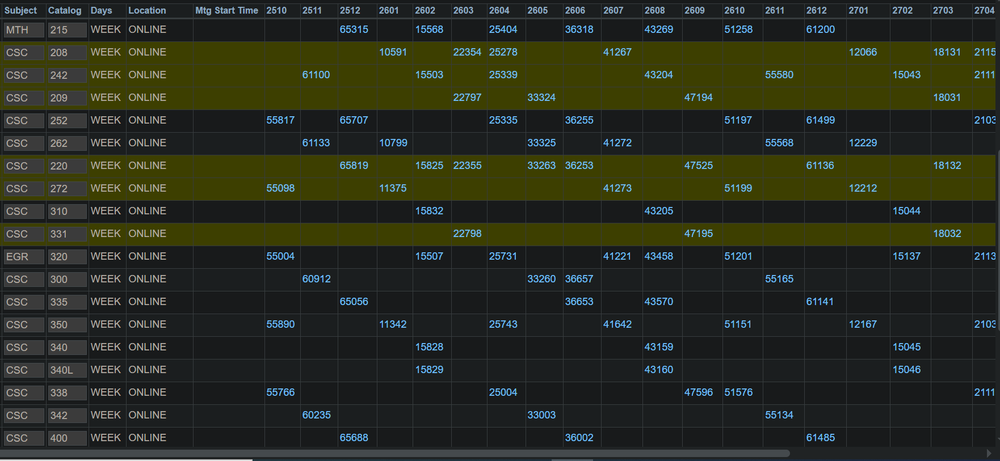

# Military Health Information Governance & Readiness System

An end-to-end data pipeline and application engineered for executive command oversight, featuring automated ETL pipelines and HIPAA/DoD-compliant PHI security layers.

## 🚀 Key Architectural Features

* **Automated ETL Pipeline (`etl_pipeline.py`)**: Extracts, transforms, and loads synthetic health records, ensuring data cleanliness, schema validation, and normalization.
* **Synthetic Data Generation (`generate_data.py`)**: Programmatically generates realistic, compliant mock military readiness and medical status records for testing and analysis.
* **Interactive Command Dashboard (`app.py`)**: Built with Streamlit to provide real-time visualization of medical readiness metrics, deployment statuses, and unit availability.
* **Secure Data Storage (`readiness.db`)**: Uses a structured SQLite relational backend designed to maintain data integrity and support analytical queries.

## 📊 Dashboard Preview

  

